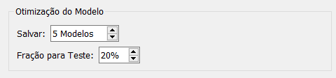
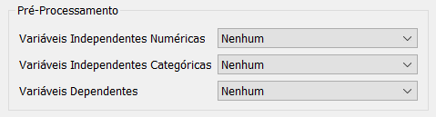
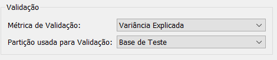
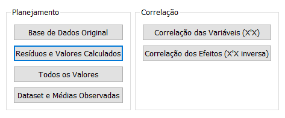

# Regressão Linear

Na opção "Selecionar Variáveis" devemos determinar as Variáveis Independentes e a Variáveis Dependentes:

Na opção "Selecionar Hiperparâmetros", devemos escolher quantos hiperparametros são modificados automaticamente para gerar o melhor modelo.

Em seguida, podemos selecionar a quantidade dos melhores modelos gerados para serem salvos e qual fração da base de dados será utilizada para validação do modelo:

Na aba pré-processamento temos as seguintes opções:

Para variáveis independentes, são possíveis três tipos de normalização: em torno da média, entre -1 e 1, e entre 0 e 1. Quando houver na base de dados variáveis com valores muito discrepantes, é necessário realizar a normalização para otimizar a convergência da função custo.

Para variáveis categóricas, temos a Codificação Ordinal e a One-Hot.

Na aba validação, podemos selecionar a métrica de avaliação do modelo e qual partição será utilizada para validação:

Gerando o modelo, a seguinte tela é aberta:

Na aba "Acesso Rápido", ao clicar na opção "Coeficientes da Regressão", será aberta uma nova aba na tela inicial do Plandox, contendo uma tabela com todos os coeficientes gerados pelo modelo.

A opção "Superfície de Resposta" só está disponivel para modelos de até duas variáveis.

Na aba, "Dataset" temos as seguintes opções:

Na opção "Resíduos e Valores Calculados" é gerada uma tabela com as previsões geradas pelo modelo, os valores verdadeiros e o resíduo em relação a esses dois valores.