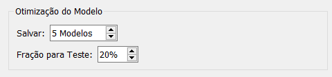
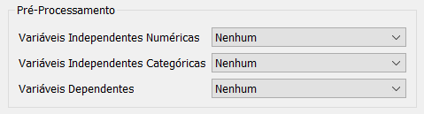
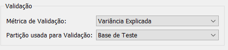
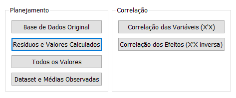

# Regressões

Detalhes do que existem em comum entre os tipos de regressão

## Regressão Linear

Na opção "Selecionar Variáveis" devemos determinar as Variáveis Independentes e a Variáveis Dependentes:

Na opção "Selecionar Hiperparâmetros", devemos escolher quantos hiperparametros são modificados automaticamente para gerar o melhor modelo.

Em seguida, podemos selecionar a quantidade dos melhores modelos gerados para serem salvos e qual fração da base de dados será utilizada para validação do modelo:

Na aba pré-processamento temos as seguintes opções:

Para variáveis independentes, são possíveis três tipos de normalização: em torno da média, entre -1 e 1, e entre 0 e 1. Quando houver na base de dados variáveis com valores muito discrepantes, é necessário realizar a normalização para otimizar a convergência da função custo.

Para variáveis categóricas, temos a Codificação Ordinal e a One-Hot.

Na aba validação, podemos selecionar a métrica de avaliação do modelo e qual partição será utilizada para validação:

Gerando o modelo, a seguinte tela é aberta:

Na aba "Acesso Rápido", ao clicar na opção "Coeficientes da Regressão", será aberta uma nova aba na tela inicial do Plandox, contendo uma tabela com todos os coeficientes gerados pelo modelo.

A opção "Superfície de Resposta" só está disponivel para modelos de até duas variáveis.

Na aba, "Dataset" temos as seguintes opções:

Na opção "Resíduos e Valores Calculados" é gerada uma tabela com as previsões geradas pelo modelo, os valores verdadeiros e o resíduo em relação a esses dois valores.

## Regressão de Ridge

A Regressão de Ridge é um modelo linear regularizado, ou seja, reduz os graus de liberdade para diminuir a chance de sobreajuste dos dados. O hiperparâmetro Alpha controla o quanto você quer regularizar o modelo. Se Alpha = 0 então a regressão de ridge se torna uma regressão linear simples. Se for um valor muito grande então todos os pesos acabarão próximos de zero e o resultado será uma linha plana que passa pela média dos dados. Pela aba "Selecionar Hiperparâmetros" pode adotar diferentes valores de alpha para serem testados no modelo:

É importante dimesionar os dados antes de executar a Regressão de Ridge, pois ela é sensível à escala das variáveis de entrada. Isso pode ser realizado pela aba "Pré-processamento", selecionando o tipo de normalização das variáveis independentes.

## Regressão de Lasso

A regressão Lasso (Least Absolute Shrinkage and Selection Operator Regression) é uma outra versão regularizada da Regressão Linear. A principal característica desse modelo é que ela tende a eliminar completamente os pesos das características menos importantes. Ou seja, ela executa automaticamente a seleção de características, ajustando as menos importante para zero. Da mesma forma que a Regressão Ridge, a Lasso deve ter o seu hiperparâmetro alpha ajustado.

## Regressão Rede Elastica

Regressão Rede Elástica (Elastic Net) pode ser definida como um meio termo da Regressão Ridge e Lasso. O termo de regularização adotado é uma simples mistura dos termos de regularização Ridge e Lasso, onde é possível controlar a taxa de mistura r. Quando r=0, a Elastic Net é equivalente a Regressão de Ridge, e quando r=1, ela é equivalente à Regressão Lasso.

## Regressão por Componentes Principais (PCR)

Detalhes de funções únicas para regressão por componentes principais (PCR)

## Regressão por Mínimos Quadrados Parciais (PLS)

Detalhes de funções únicas para regressão por mínimos quadrados parciais (PLS)

## Regressão por Redes Neurais Artificiais

Neste módulo há um conjunto maior de hiperparâmetros a serem ajustados. Dentre eles temos:

- Neurônios;
    - Representam a quantidade de características novas que serão aprendidas em função da combinação linear das características originais.
- Camadas escondidas:
    - Quantidade de camadas com neurônios que serão adotadas no modelo. Geralmente, 1 camada oculta já obtem bons resultados desde que tenha a quantidade suficiente de neurônios. Adicionando mais camadas com exponencialmente menos neurônios, o modelo pode mapear funções ainda mais complexas e treinar mais rápido.
- Épocas:
    - Representa a quantidade de vezes que o modelo passará sobre o dataset de treino. Quanto maior o número de épocas, maior será o tempo de treinamento.
- Batch:
    - Tamanho do lote de amostras do conjunto de treinamento que será utilizado para atualizar os pesos da rede.
- Função de Ativação:
    - ReLU;
    - Sigmoide;
    - Tangente Hiperbólica;
    - ELU;
- Taxa de Aprendizagem:
    - Representa o tamanho do passo dado para minimizar a função de custo.
- Função de Custo:
    - Erro Quadrático Médio;
    - Erro Absoluto Médio;
    - Erro Percentual Absoluto Médio;
    - Erro Logarítmo Quadrático Médio;
- Otimizador:
    - SGD;
    - ADAM;
    - Adagrad;
    - RMSprop;