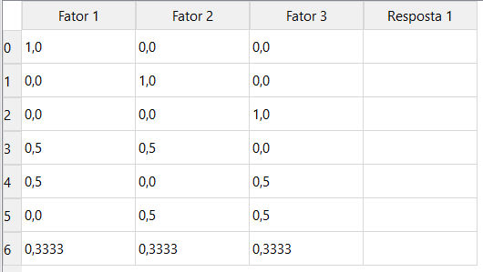

# Planejamento de Mistura

### O que é ?

Planejamento de mistura é o tipo de planejamento de superfície de resposta em que o produto sob investigação é feito de vários componentes e ingredientes. 

### Objetivo do planejamento de mistura

São úteis porque muitas atividades de projetos e desenvolvimento de produtos em situações industriais envolvem formulações ou misturas, onde a resposta é função das proporções dos diferentes ingredientes da mistura.

# Planejamento de mistura

No planejamento de misturas temos dois ou mais componentes misturados nas devidas proporções para formar um produto final, procura-se encontrar a proporção ótima de cada componente para otimizar uma determinada característica do produto.
Nos experimentos para misturas sempre trabalhamos com proporção de componentes que pode ser em:
* Massa;
* Volume;
* Fração Molar;

Considerando um planejamento de misturas de três fatores em cada linha a soma dos fatores é igual a 1.

Os tipos de planejamentos podem ser classificados em:

## Centróide Simplex

Para o planejamento Simplex-Centróide com (q) componentes, temos que número de experimentos (N) será: N= 2^q - 1, para (q) misturas puras. Portanto, para o exemplo ilustrado com 3 componentes, temos que o número de experimentos N será igual a 7, composto por três misturas puras, duas binárias e uma ternária, conforme pode ser ilustrado na Figura 1.

Na Figura 2, está ilustrado o sistema de coordenadas simplex para três componentes. Em cada vértice está identificado cada componente do planejamento, indicando uma mistura pura. Já no ponto central das arestas temos as misturas binárias, que são representadas pela mistura de dois componentes. E na posição central do sistema de coordenadas, vamos ter a mistura dos três componentes, com proporção de um terço de cada.

## Rede Simplex
### Linear

### Quadrático

### Cúbico